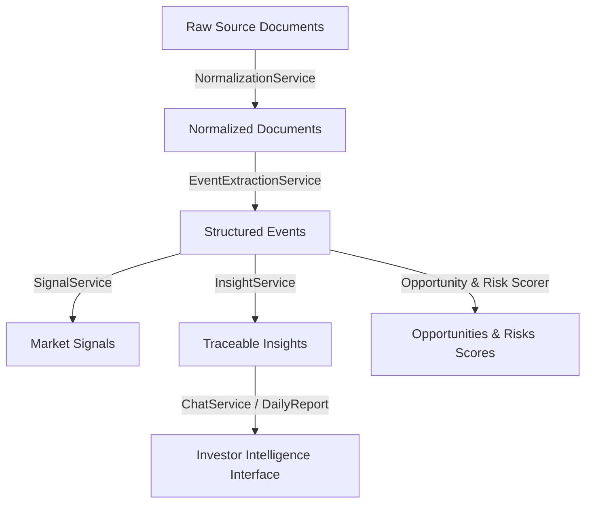

# AI Equity Intelligence: Architecture, Workflow, and Design Document

This document provides a detailed breakdown of the **AI Equity Intelligence** platform's current design, technical architecture, internal data workflow, frontend/backend communication, and LLM integrations.

---

## 1. System Overview & Philosophy

The platform is designed as an **event-centric equity intelligence system** focused primarily on the **Indian stock market (NSE/BSE)** with reference context from global markets (**United States and Japan**). 

The platform is explicitly designed **not** as a trading advisory engine. Instead, it is an explainable intelligence workspace. Every piece of intelligence is built on top of structured events and must include trace evidence, a confidence score, logical reasoning, and watch points.

### Architectural Flow


---

## 2. Directory Layout & Architecture Mapping

The project is structured as a mono-repo divided into backend, frontend, infrastructure config, developer scripts, and tests.

```text
AIEquityIntelligence/
├── backend/                  # FastAPI Modular Monolith
│   ├── app/
│   │   ├── api/              # Versioned API routes & dependencies
│   │   ├── chat/             # Chat orchestration (currently placeholder)
│   │   ├── core/             # Configuration & central AI gateway client providers
│   │   ├── extraction/       # AI-based event extraction modules
│   │   ├── ingestion/        # Feed ingestion adapters & seed documents
│   │   ├── intelligence/     # Scoring logic and signal/insight adapters
│   │   ├── models/           # Domain schemas (Pydantic models)
│   │   ├── repositories/     # Persistence adapters (currently In-Memory)
│   │   ├── services/         # Core business logic orchestrators
│   │   └── main.py           # FastAPI Application Entrypoint
│   └── pyproject.toml        # Backend python dependencies (FastAPI, SQLAlchemy, etc.)
├── frontend/                 # Next.js Dashboard & Conversational UI
│   ├── app/                  # Next.js App Router (pages & layouts)
│   ├── components/           # Custom UI dashboard controls & panels
│   ├── lib/                  # Fetch API helpers, format utilities & static demo data
│   └── package.json          # Node dependencies (Next.js, React, Tailwind, Lucide icons)
├── infra/                    # Deployment configurations
│   └── docker-compose.yml    # Orchestrates Postgres, Redis, OpenSearch, Backend & Frontend
├── scripts/                  # Command line tools for launching and seeding
│   ├── start.sh              # Automatic setup and launch script
│   ├── stop.sh               # Stops background server instances
│   └── seed_backend.py       # Developer utility to feed demo files into ingestion
└── tests/                    # Backend Pytest suite
```

---

## 3. How Backend Services Work

The backend is built as a **FastAPI Modular Monolith** matching clean architecture principles:
* **API Layer (`app/api/v1`)**: Contains versioned routes. Endpoint handlers are controllers that only validate parameters, inject dependencies, and delegate business logic to service components.
* **Service Layer (`app/services`)**: Implements core orchestration and business rules.
* **Repository Layer (`app/repositories`)**: Isolates the data persistence layer.

### The Ingest & Intelligence Pipeline Workflow
When a new document (e.g., an NSE disclosure or a news item) is submitted via `POST /api/v1/documents`, the [IntelligencePipeline](file:///Users/sahilsingh/Documents/AIEquityIntelligence/backend/app/services/pipeline.py) orchestrates the following operations:

1. **Normalization**: [NormalizationService](file:///Users/sahilsingh/Documents/AIEquityIntelligence/backend/app/services/normalization.py) cleans up whitespace in the document content and computes a SHA-256 hash checksum to prevent duplicate ingestion.
2. **Persistence**: The normalized document is stored in the repository.
3. **Event Extraction**: [EventExtractionService](file:///Users/sahilsingh/Documents/AIEquityIntelligence/backend/app/services/event_extraction.py) inspects the content. It searches for indicators (such as contract wins, earnings beats, regulatory penalties, macro-events) and creates structured `Event` objects.
4. **Signal and Insight Derivation**:
   * For each event, [SignalService](file:///Users/sahilsingh/Documents/AIEquityIntelligence/backend/app/services/signals.py) generates a market `Signal` with calculated strength and confidence.
   * For each event, [InsightService](file:///Users/sahilsingh/Documents/AIEquityIntelligence/backend/app/services/insights.py) drafts a structured `Insight` outlining what happened, why it matters, and watch points.
5. **Opportunity and Risk Scoring**: The pipeline clears previous scores and triggers a recalculation across all events.
   * [OpportunityService](file:///Users/sahilsingh/Documents/AIEquityIntelligence/backend/app/services/scoring.py) aggregates positive events to calculate an Opportunity score (out of 100) per company.
   * [RiskService](file:///Users/sahilsingh/Documents/AIEquityIntelligence/backend/app/services/scoring.py) aggregates negative events to calculate a Risk score (out of 100) per company.

### Backend Endpoints Table
| Endpoint | Method | Input DTO | Output DTO | Description |
| :--- | :--- | :--- | :--- | :--- |
| `/health` | `GET` | None | Dict | Verifies service health status. |
| `/api/v1/companies` | `POST` | `Company` | `Company` | Manually indexes a new company profile. |
| `/api/v1/documents` | `POST` | `DocumentCreate` | `NormalizedDocument` | Submits a news/filing document into the pipeline. |
| `/api/v1/events` | `GET` | None | `List[Event]` | Fetches all parsed events, sorted chronologically. |
| `/api/v1/signals` | `GET` | None | `List[Signal]` | Fetches all calculated signals. |
| `/api/v1/opportunities` | `GET` | None | `List[Opportunity]` | List scored company opportunities. |
| `/api/v1/risks` | `GET` | None | `List[Risk]` | List scored company risks. |
| `/api/v1/insights` | `GET` | None | `List[Insight]` | List explainable insights. |
| `/api/v1/chat` | `POST` | `ChatQuestion` | `ChatAnswer` | Processes natural language inquiries. |
| `/api/v1/reports/daily` | `GET` | None | `DailyReport` | Builds an aggregated daily market recap. |

---

## 4. How the UI Service Works

The frontend dashboard is developed using **Next.js (App Router)** and TypeScript.

### Data Fetching and Resilient Fallback
In [frontend/lib/api.ts](file:///Users/sahilsingh/Documents/AIEquityIntelligence/frontend/lib/api.ts), the UI fetches dashboard stats from the backend. 
```typescript
const API_BASE = process.env.NEXT_PUBLIC_API_BASE_URL ?? "http://localhost:8000/api/v1";
```
It implements a built-in safety net: **If the backend API endpoints fail or return empty datasets, the frontend automatically falls back to locally defined mock data** (`frontend/lib/demo-data.ts`). This ensures the UI is immediately fully interactive and visual even without a seeded database.

### Dashboard Layout & UI Sections
1. **Market Metrics (Market Pulse)**: Highlights counts of structured events, positive signals, risk factors, and average system confidence.
2. **Top Opportunities & Top Risks**: Displays scored stock tickers with visual progress bars representing potential and risk values.
3. **Event Feed**: Lists parsed documents, showing the type of event, confidence, and source metadata (e.g., NSE Filing, BSE Regulatory updates).
4. **Conversational AI Widget**: Allows typing in market-related questions.
5. **Daily Intelligence Report**: Showcases generated insights and their underlying reasoning.

---

## 5. Model Inference Analysis (Current State & Bypasses)

The backend features an isolated, modular **AI Gateway client** located under [backend/app/core/ai](file:///Users/sahilsingh/Documents/AIEquityIntelligence/backend/app/core/ai). It supports:

1. **Gemini**: Relying on the `google-genai` client library (`gemini-2.0-flash`).
2. **Groq**: Relying on the `groq` client SDK (`llama-3.3-70b-versatile`).
3. **Ollama**: Relying on async `httpx` connections to a local Ollama server running `llama3.2`.

### The "Placeholder Bypass" Caveat
While these model clients are fully implemented, **none of them are currently integrated into the active backend service paths**. 
* **Event Extraction**: Currently operates via a deterministic keyword/regex mapper inside `EventExtractionService`. It scans for phrases like "beat", "contract win", "miss", etc.
* **Chat Q&A**: Currently operates via a client-side keyword tokenizer in `ChatService`. It returns matching insight titles, bypassing LLM generation completely.
* **Scoring**: Uses deterministic weighted arithmetic formulas in `scoring.py`.

The AI configuration values reside in `.env`, but as of the current implementation version, the backend pipeline runs **entirely locally and deterministically without firing API calls to Gemini, Groq, or Ollama**.

---

## 6. How to Run the Platform

You can spin up the application in three ways.

### Option A: Automatic Launch Script (Recommended)
From the project root:
```bash
./scripts/start.sh
```
This script will:
* Check for dependencies (Python 3.13+ and Node 22+).
* Configure Python virtual environment `.venv` and install dependencies.
* Run `npm install` inside the `frontend` folder.
* Spin up FastAPI (port 8000) and Next.js (port 3000) in the background.
* Output logs directly to the `logs/` folder.

You can stop background processes at any time using:
```bash
./scripts/stop.sh
```

### Option B: Local Docker Compose (Full Stack with Databases)
To spin up all services—including **PostgreSQL**, **Redis**, and **OpenSearch** alongside the frontend/backend:
```bash
docker compose -f infra/docker-compose.yml up --build
```

### Option C: Manual Launch (Step-by-Step)
1. **Backend**:
   ```bash
   cd backend
   python3 -m venv .venv
   source .venv/bin/activate
   pip install -e ".[dev]"
   uvicorn app.main:app --reload --host 0.0.0.0 --port 8000
   ```
2. **Frontend**:
   ```bash
   cd frontend
   npm install
   npm run dev
   ```

---

## 7. Current Project Limitations & Roadmap

### 1. In-Memory Persistence Limitation
The backend's database repositories are stored entirely in a Python dictionary. 
> [!WARNING]
> Because database endpoints operate on an in-memory repository, running `python scripts/seed_backend.py` from your terminal seeds a separate python process. That memory is lost when the script exits, and it **will not** populate the running `uvicorn` instance's memory.

To seed the running backend, you must send requests directly to the API server:
```bash
curl -X POST http://localhost:8000/api/v1/documents \
  -H "Content-Type: application/json" \
  -d '{
    "source": {"name": "NSE Filing", "trust_tier": "tier_1", "trust_weight": 10},
    "source_type": "filing",
    "title": "TCS reports earnings beat",
    "content": "TCS delivered strong earnings above estimate and raises guidance.",
    "published_at": "2026-06-21T10:00:00Z",
    "metadata": {"company": "TCS"}
  }'
```

### 2. Conversational UI Widget is Static
The interactive chat text box in the Next.js UI does not have active React state bindings or click/submit listeners connected to the `/api/v1/chat` endpoint. It currently acts as a visual mockup.

### Next Technical Milestones
1. **Database Persistence**: Swap the in-memory repository for SQLAlchemy ORM and Postgres database schemas, using Alembic migrations.
2. **Search Indexing**: Connect OpenSearch to store documents and enable vector/hybrid RAG searches.
3. **Activate AI Gateway**: Wire the factory client into `EventExtractionService` and `ChatService` to substitute rule-based parsers with actual LLM inference.
4. **Interactive Chat**: Bind the frontend text box to trigger API calls to `/chat` and display response objects.
